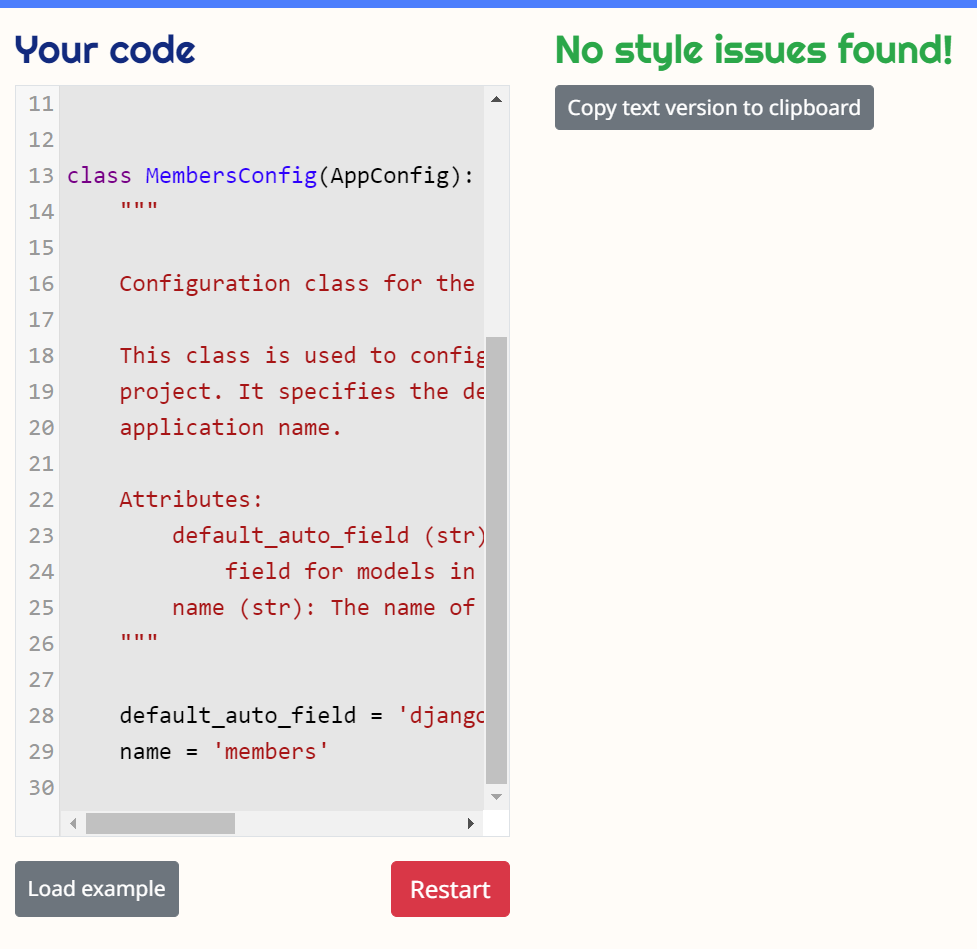
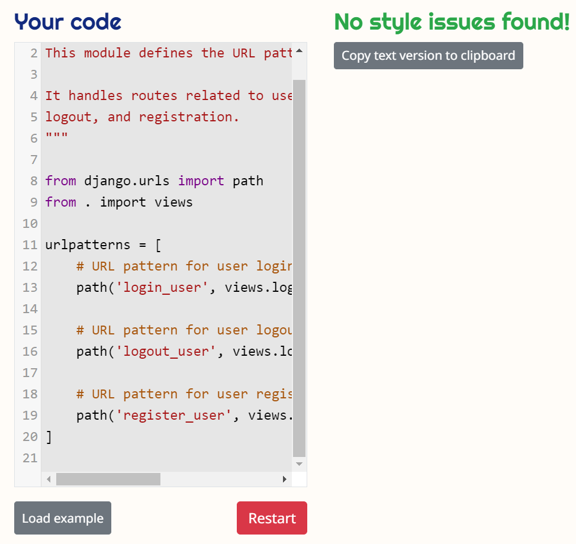

# Booking System Django Project

## Overview

This project is an online booking system built with Django. It began as a personal learning exercise and has since evolved into a fully-fledged project aimed at providing a booking platform for a family-run veterinary clinic. The system is designed to simplify the process of booking consultations, medical services, and pet care appointments.

You can check the live project by clicking [here](https://vetappt-9a4ac7bc1416.herokuapp.com/).

## Project Goals

- **Educational Purpose:** The project was initially created to enhance my Django development skills.
- **Long-Term Vision:** The aim is to develop a fully functional booking system for a veterinary clinic, delivering a seamless and efficient experience for clients.
- **Customisation:** The project includes modifications and enhancements tailored to meet the specific needs of the clinic, with plans for ongoing development.

## Inspiration

This project was inspired by John Abdsho's tutorial, which provided a solid foundation for its development. If you are interested in learning Django, I highly recommend checking out his work. You can find his original project here: [John Abdsho's Clinic Booking Project](https://github.com/Johnkh2002/Clinic-Booking-Project).

## Importance and Usefulness

This application offers significant value to both clients and clinic staff by streamlining and improving the management of appointments and pet care services.

## Why Use This Application?

### Convenient Appointment Management

- **Easy Booking and Rescheduling:** Quickly book, cancel, or reschedule appointments without the need for phone calls or in-person visits. Manage your schedule directly from your desktop or mobile device.
- **Immediate Confirmation:** Receive instant confirmation of your bookings, reducing uncertainty and ensuring your appointments are secured.

### Efficient Service Customisation

- **Tailored Service Options:** Access a range of customisable services to meet your specific needs, whether for consultations, medical services, or pet care.

### User-Friendly Interface

- **Responsive Design:** Enjoy a seamless experience across all devices, whether using a smartphone, tablet, or computer. The intuitive design makes navigation straightforward and efficient.

### Improved Administrative Efficiency

- **Streamlined Administration:** For clinic staff, the app simplifies appointment management, reduces manual paperwork, and enhances operational efficiency by centralising booking management.

## Features

- **User Authentication:** Basic user registration and login system.
- **Appointment Booking:** Clients can book appointments for consultations, medical services, or pet care.
- **Appointment Management:** Admins can view, approve, or cancel bookings.
- **Service Customisation:** Allows the clinic to add different services.
- **Responsive Design:** Accessible on both desktop and mobile devices.
- **User Management:** Users can edit their recent bookings, including the ability to cancel or reschedule appointments.
- **Pet Registration:** Users can register their pets for services, making it easier to manage and track the services provided for each pet.

## Future Plans

The Booking System project has several planned enhancements to improve functionality and user experience:

- **Payment Integration:** Introducing online payment capabilities, allowing clients to pay for services directly through the application.
- **Notification System:** Integrating a system to send email or SMS reminders for upcoming appointments.
- **Enhanced User Interface:** Refining the user interface for a more polished and intuitive experience.
- **Reports and Analytics:** Developing tools to provide the clinic with valuable insights into appointment trends and service usage, aiding in effective management.
- **Contact Page and Services Offered Pages:** While the contact page and services offered pages are included as examples in the current implementation, they will be tailored to meet the specific needs of my family's business. These pages will be customised to provide relevant contact information and a detailed list of services offered by the clinic.

## Requirements

To successfully run and deploy this project, the following Python packages and dependencies are required:

- asgiref==3.8.1
- dj-database-url==2.2.0
- Django==5.0.7
- django-environ==0.11.2
- django-heroku==0.3.1
- gunicorn==22.0.0
- packaging==24.1
- pillow==10.4.0
- psycopg2==2.9.9
- psycopg2-binary==2.9.9
- sqlparse==0.5.0
- typing_extensions==4.12.2
- tzdata==2024.1
- waitress==3.0.0
- whitenoise==6.7.0

Make sure to install these dependencies using pip by running the following command:
`pip install -r requirements.txt`

This command ensures that all necessary packages are installed and properly configured.

## Frontend Frameworks and Libraries

This project uses the following frontend frameworks and libraries:

**Bootstrap 5.2.1:** Employed for responsive design and styling throughout the project, integrated via CDN.

**HTML:**
`<link href="https://cdn.jsdelivr.net/npm/bootstrap@5.2.1/dist/css/bootstrap.min.css" rel="stylesheet" integrity="sha384-iYQeCzEYFbKjA/T2uDLTpkwGzCiq6soy8tYaI1GyVh/UjpbCx/TYkiZhlZB6+fzT" crossorigin="anonymous">`

``

## Testing

The application has been manually tested to ensure that all features work as expected.

## Validator Checker

### Python

#### Booking

**app.py**

**form.py**

**models.py**

**urls.py**

**views.py**
Booking views.py image validator checker could not be provided due to code exceeding the number of characters accepted by the checker, but code has been formatted accordingly to the guide.

#### Members

**app.py**

**form.py**

**urls.py**

**views.py**

#### Pets

**app.py**

**form.py**

**models.spy**

**urls.py**

**views.py**

#### Project Core

**asgi.py**

**settings.py**

**urls.py**

**wsgi.py**

**env.py**

**manage.py**

**HTML**

## Layout

**Homepage**

**Sign In/Sign Up**

**Sign Up Completed**

**Task Bar After Signing In**

**Online Booking**

**User Panel**

**Staff Panel**

**Register Pet**

**My Pet**

**Sign out Successful**

## Bugs Encountered

### ModuleNotFoundError: No module named 'booking_system'

- **Issue:** Running Django management commands (e.g., `python manage.py makemigrations`) resulted in a `ModuleNotFoundError`, indicating that Django could not find the module `booking_system`.
- **Cause:** This error occurred despite the `DJANGO_SETTINGS_MODULE` environment variable and project structure being correctly configured.
- **Resolution:** The issue was resolved after renaming a duplicate directory, saving the changes, closing the VSCode app, and reopening it.
- **Current Status:** After these steps, the `ModuleNotFoundError` was fixed, and Django can now correctly locate and use the `booking_system` module.

### SystemCheckError: 'django.contrib.sessions.middleware.SessionMiddleware' must be in MIDDLEWARE

- **Issue:** Attempting to run management commands triggered a `SystemCheckError` stating that `'django.contrib.sessions.middleware.SessionMiddleware'` must be included in the `MIDDLEWARE` setting to use the Django admin application.
- **Cause:** This error persisted even though `SessionMiddleware` was correctly added to the `MIDDLEWARE` list and placed in the correct order before `AuthenticationMiddleware`.
- **Resolution:** The issue was fixed after renaming a duplicate directory, saving the changes, closing the VSCode app, and reopening it.
- **Current Status:** With these steps, the `SystemCheckError` was resolved, and the `SessionMiddleware` is now correctly recognised and functioning.

### Heroku Deployment Issue: ModuleNotFoundError

- **Issue:** When deploying the Django project to Heroku, the application failed with a `ModuleNotFoundError: No module named 'booking_system'`, even though the application worked perfectly on the local server.
- **Cause:** With the help of my tutor, we were able to identify that the issue was likely due to the structure of the project, where the directories were nested and not located in the root directory. This structure caused discrepancies between the local and Heroku environments, leading to incorrect paths or environment settings in Heroku, despite the local configurations being correct
- **Resolution:** To resolve the issue, I've moved all directories and files, including manage.py, to the root of the project. This adjustment ensured that Heroku could correctly locate and load the necessary modules during deployment.
- **Current Status:** After relocating the files to the project root, the Heroku deployment succeeded. The local server on VSCode continues to function correctly, confirming that the issue was specific to the project's directory structure in the Heroku environment. The app is now working perfectly after these changes.

## Deployment

This section outlines the steps taken to deploy this project from the VSCode editor to GitHub and Heroku.

## Deploying to GitHub

1. **Initialise a Git repository:** In the VSCode terminal, navigate to your project directory and run `git init` to initialise a new Git repository.
2. **Commit your changes:** Add all files to the staging area with `git add .`, then commit the changes with `git commit -m "Initial commit"`.
3. **Create a new repository on GitHub:** Go to GitHub and create a new repository.
4. **Link the local and remote repositories:** In your local repository, add the URL of the remote repository with the command `git remote add origin https://github.com/LihMartins/bookingsystem`.
5. **Push to GitHub:** Push your local commits to the remote repository with `git push -u origin main`.

## Deploying to Heroku

1. **Create a new app on Heroku:** Log in to Heroku and create a new app.
2. **Prepare the app for deployment:** Ensure that your project has a `Procfile` and `requirements.txt` file. The `Procfile` should contain the line `web: gunicorn app:app`.
3. **Commit any changes:** If any changes were made, commit them with Git.
4. **Link the Heroku app to the local repository:** In your local repository, link the Heroku app with the command `heroku git:remote -a vetappt`.
5. **Push to Heroku:** Push your local commits to the Heroku app with `git push heroku main`.
6. **Open the app:** Finally, open the app in a web browser with `heroku open`.

## Credits

This project was made possible through the support and resources provided by various guides, tutorials, and materials that significantly enhanced my understanding of Django and web development. Special thanks to the following resources that guided me throughout the journey:

- **[W3Schools Django Tutorial](https://www.w3schools.com/django/)**: An essential guide for understanding Django basics and best practices.
- **[Django Tutorial On How To Create A Booking System For A Health Clinic](https://www.youtube.com/watch?v=XXua85cCiT0)**: A comprehensive video tutorial that deepened my understanding of Django's core features.
- **[Python Django Explained In 8 Minutes](https://www.youtube.com/watch?v=IV7jw70Gu2o)**: This video provided practical insights and examples that were instrumental in the development of my project.
- **[How to Upload Files with Django by Simple is Better Than Complex](https://simpleisbetterthancomplex.com/tutorial/2016/08/01/how-to-upload-files-with-django.html)**: This tutorial offered clear and practical guidance on implementing file uploads in Django.
- **[Django Documentation - File Uploads](https://docs.djangoproject.com/en/stable/topics/files/)**: The official Django documentation provided in-depth information and best practices for handling file uploads.
- **[Django File Upload Tutorial by Traversy Media](https://www.youtube.com/watch?v=YkpFR0hRY84)**: A helpful video tutorial on file uploads in Django, offering hands-on examples and practical advice.
- **[Django Documentation](https://docs.djangoproject.com/en/stable/)**: The official Django documentation was an indispensable resource throughout the project, offering detailed explanations and reference materials.
- **[Forum Discussion on Hosting Django App on Heroku](https://forum.djangoproject.com/t/beginner-hosting-django-app-on-heroku-problem/15349)**: A community discussion that provided insights into common issues and solutions when deploying Django apps on Heroku.
- **[Heroku's Getting Started with Python Guide](https://devcenter.heroku.com/articles/getting-started-with-python?singlepage=true)**: A detailed guide for deploying Python applications, including Django, on Heroku.
- **[Reddit Thread on Gunicorn ModuleNotFoundError](https://www.reddit.com/r/Heroku/comments/1dcvz7g/gunicorn_error_modulenotfounderror_no_module/)**: Helped resolve issues related to Gunicorn during deployment.
- **[Plotly Community Thread on ModuleNotFoundError](https://community.plotly.com/t/heroku-modulenotfounderror-no-module-named-config/52769)**: Provided solutions to specific deployment errors.
- **[Stack Overflow Discussion on Heroku ImportError](https://stackoverflow.com/questions/12703388/heroku-importerror-no-module-named-site)**: Offered a solution to ImportError issues encountered during deployment.
- **[Django Stars Article on Front-End for Booking Platforms](https://djangostars.com/blog/front-end-for-booking-platforms/)**: Provided insights into building and optimising the front end of booking platforms.
- **[Heroku Deploy Failure - Top 3 Errors Newbies Always Have](https://www.youtube.com/watch?v=IV7jw70Gu2o)**: A tutorial that offered guidance on deploying Django apps on Heroku.
- **[Heroku Application Error Fixing | H14 Error | Heroku ps:scale web=1 Fixed](https://www.youtube.com/watch?v=xxua85cCiT0)**: Provided helpful tips on Django project setup and deployment.
- **Code Institute Material**: The curriculum provided by Code Institute was invaluable in laying the foundation for my understanding of web development and Django.

## References

The code structure and logic used in this project are credited to **[John Abdsho's Clinic Booking Project](https://github.com/abdsho/clinic-booking)**. His work served as a significant reference point and foundation for my development process.

## Tools

This project was developed using the following tools:

- **Visual Studio Code (VSCode)**: The primary code editor used for the development of this project. VSCode provided a powerful, yet lightweight, environment for writing, debugging, and managing the project code. Its extensive library of extensions, integrated terminal, and Git support greatly enhanced the efficiency and effectiveness of the development process.

Other tools and resources were also employed throughout the development, including:

- **Git**: Version control system used to manage the project's source code.
- **Heroku**: Platform as a service (PaaS) used for deploying and hosting the application.
- **PostgreSQL**: The database management system used to handle data storage and retrieval in the production environment.

## Contributing

This project is still in development, and contributions are welcome! If you have any ideas or suggestions, feel free to submit a pull request or open an issue.

## License

This project is open-source and available under the MIT License.
